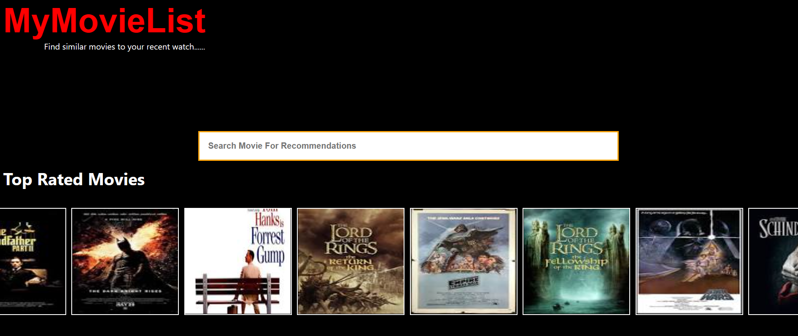
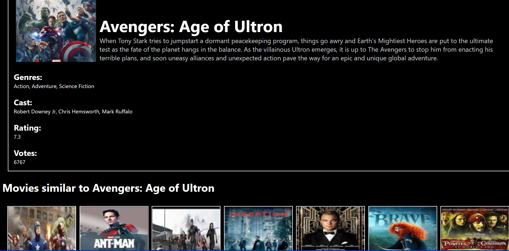

# Movie_Recommendation_System
The repository contains the code for creating a recommendation system with Demographic and Content based filtering recommendation methods and a webapp for the system.

## Hosted App:
https://ayush21042002.github.io/Movie_Recommender/

## Screenshots

<p align="left">
 
 &nbsp;&nbsp;&nbsp;&nbsp;

</p> 


<b>Running the server</b>

```
cd web_app
cd server
pip install -r requirements.txt
python app.py

```


<b>Running the client</b>


```
cd web_app
cd client
npm install
npm start

```

